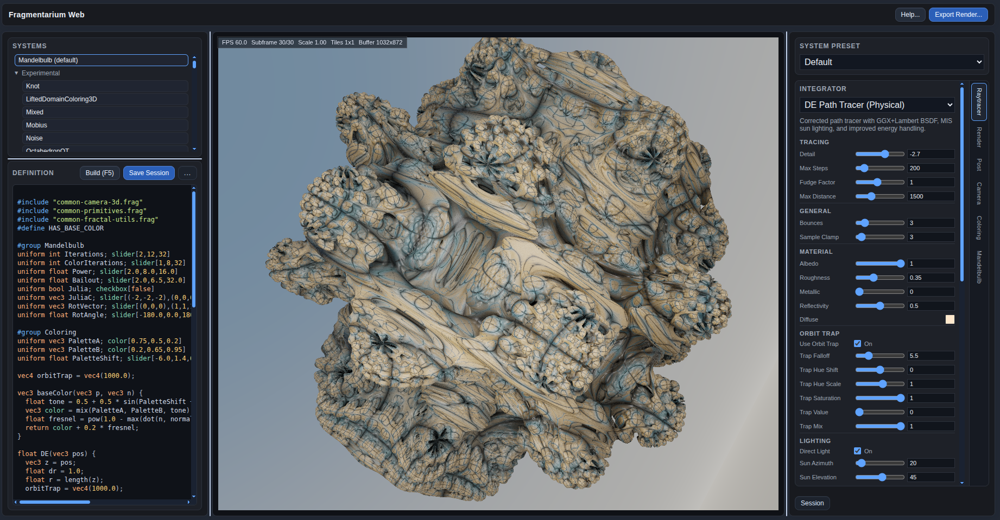

# Fragmentarium Web

Web-based Fragmentarium-inspired fractal renderer using React, TypeScript, and WebGL2.

An environment for exploring path traced 3D fractals.

## Live Demo

https://syntopia.github.io/FragmentariumWeb/

## Original Project

https://github.com/Syntopia/Fragmentarium

## Screenshot

## Attributions

This is a port of my classic Fragmentarium desktop application:
https://github.com/Syntopia/Fragmentarium

Created by Mikael Hvidtfeldt Christensen (together with OpenAI's Codex and Claude Code)

## License

This project is licensed under the MIT License. See [LICENSE](./LICENSE).

Licensed and distributed under MIT license.

Notice: some fragments are copyrighted by other authors, and may carry other licenses. Please check the fragment file header before redistributing.

## Acknowledgement

Much of the inspiration and formulas for Fragmentarium came from the community at Fractal Forums, including Tom Beddard, Jan Kadlec, Iñigo Quilez, Buddhi, Jesse, and others. Special thanks goes out to Knighty and Kali for their great fragments. All fragments should include information about their origins - please notify me, if I made any mis-attributions.
